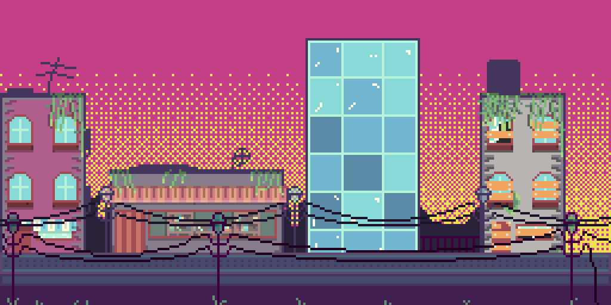

<!--título-->

  <ul align="center">
    
<h1 style="display: inline-block">Hello World</h1>

    Uma linguagem não faz seu código ser bom, programadores bons fazem seu código ser bom. 

<!-- Presentation -->

  - Olá ✌, Sou José Fernandes! Estudante de informática para internet na Etec Santa Isabel

  - 👏 Atualmente estou estudando por conta desenvolvimento de jogos

  - 🔭 Estou a procura de trabalhos na área de jogos

  - Hi ✌, I'm José Fernandes! Student of Computing for internet in Etec Santa Isabel

  - 👏 I’m currently for only game development

  - 🔭 I am looking for jobs in game development area

<!-- Dropdown -->

  
👨‍💻 More about me

  - 💬 I am 15 years old, currently living in Brazil. I know a bit of English and have experience with Python, C#, C++, engines like Godot, Unity, Gamemaker Studio 2 and Construct, and i know pixel art.

  - ⚡ I enjoy reading, whether it's a good book, manga, or comics, as well as watching movies and playing games! I believe that our personal interests contribute to a more refined perception of things and problem-solving. \o/

<!-- Links -->

<!-- GithubStats -->

<!-- Portfolio -->
## Portfolio:
- [Seaborn Data Visualization](https://github.com/)
- [Exploratory Data Analysis](https://github.com/)
- [Interactive Data Visualization](https://github.com/)
- [Data Querying and Analysis](https://github.com/)
- [Client Registry System](https://github.com/)

<!-- GIF -->

  

## 🔥 Skills
<!-- Skills: Programming Languages -->
  

    <h3>Programming Languages</h3>
    
    
    
    
    
    
  

  
  <!-- Skills: Tools & Frameworks -->
  

    <h3>Tools & Frameworks</h3>
    
    
    
  

  
